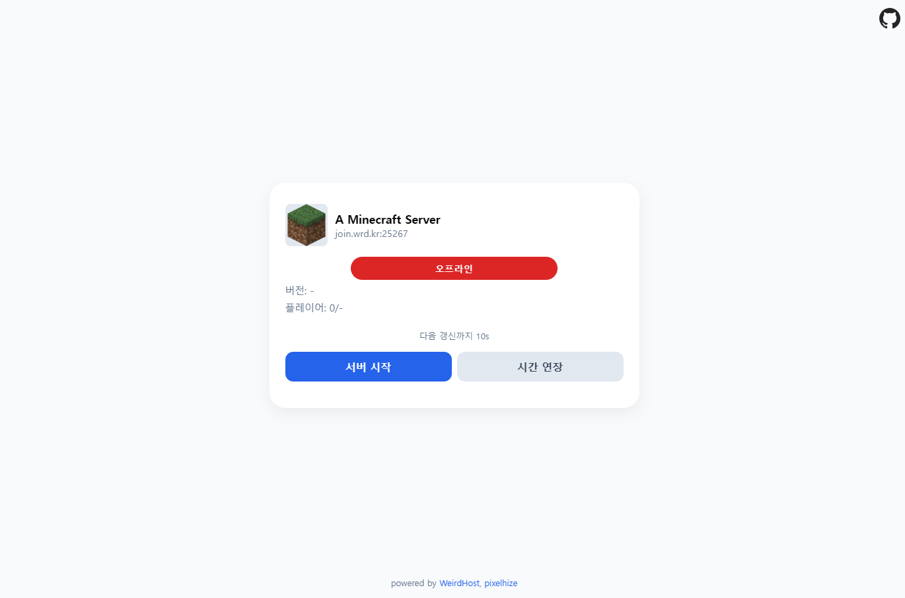

# WeirdHost Status 페이지

> [!CAUTION]
> .env에 써져있는 값들은 배포시 함께 전달됩니다. 프로덕션시 다른 방법을 사용하세요.

스택: Vite + React 
개발자: PIXELHIZE

## 사용 방법

## 기여 방법

RP을 요청하시면 검토 후 병합해드립니다.

## 오류 발견 & 기능 요청

Issues를 열어 보고하세요!
